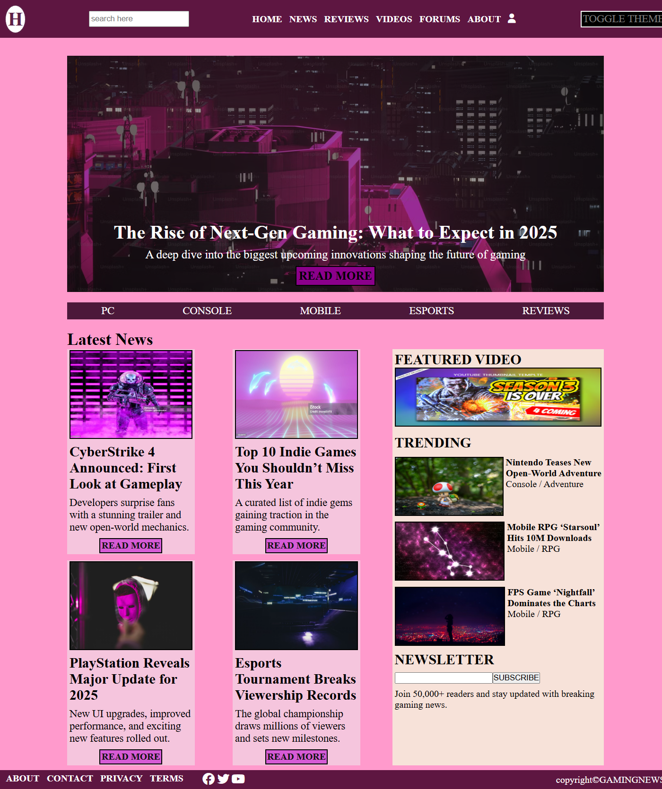
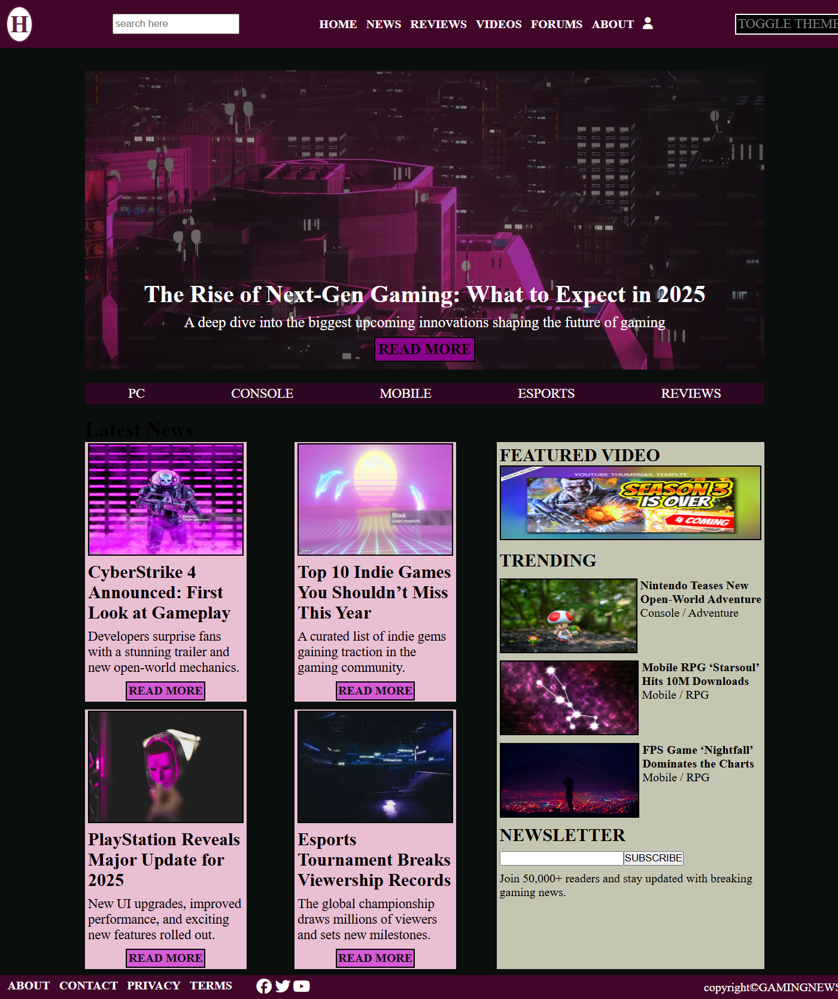

# toggleTheme
The Dark/Light Mode Application is a responsive web application built using HTML, CSS, and JavaScript. It allows users to switch seamlessly between dark and light themes, providing a personalized and accessible browsing experience.
- [Live Demo](https://toggle-theme-jbe8eyyf8-sukhwinder-s-projects.vercel.app)
  
## Table of Contents
- [Overview](#overview)
- [Features](#features)
- [Tech Stack](#tech-stack)
- [Usage](#usage)
- [Screenshots](#screenshots)
- [Deployment](#deployment)
- [Future Improvements](#future-improvements)

## overview
The Dark/Light Mode Application is a responsive web application built using HTML, CSS, and JavaScript. It allows users to switch seamlessly between dark and light themes through dynamic theme management using CSS custom properties (root variables).
The application updates colors, providing a personalized and accessible user experience. This project was developed to strengthen frontend development skills and modern CSS techniques such as custom properties and theme switching.

## features
- Toggle between dark and light themes
- Responsive design for all screen sizes
- Clean and modern user interface
- Smooth theme switching experience
- User-friendly design

## tech-stack
- HTML5 – Structure and layout
- CSS3 – Styling and responsive design
- JavaScript (ES6) – Calculator logic and functionality
- Git & GitHub – Version control
- Vercel – Deployment and hosting

## usage
- Open the application in your browser.
- Click the theme toggle button.
- Switch between dark and light modes instantly.
- Continue browsing with your preferred theme.

## screenshots
 ### Light Mode

 ### Dark Mode
 

## deployment
The project is deployed and hosted on vercel
Live: https:toggle-theme-jbe8eyyf8-sukhwinder-s-projects.vercel.app

## future-improvements
- Add multiple color themes
- Add smooth transition animations
- Convert the application to React.js
